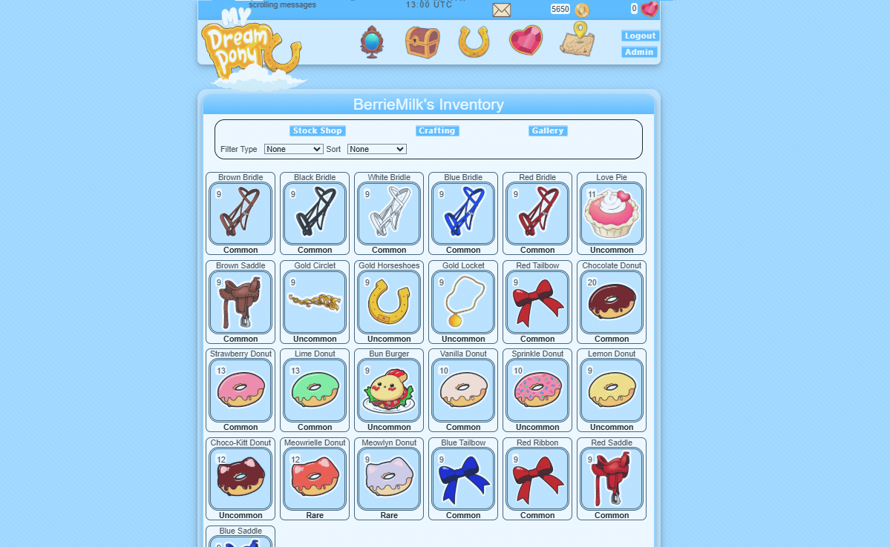

<b>My Dream Pony</b>

Is a Virtual Pet Site development project based in PHP/CSS/HTMl/MYSQL/JAVASCRIPT using Laravel 11 framework. This is a hobby project I'm developing to further my coding skills. 
<b>Home Page:</b>
Current potential blade layout

<b>Generator</b>

Pony generator tool that combines color combinations to produce new pony images. 

<b>Inventory</b>

Filterable with hover and interactive linking to item usage. Also displays MYSQL information relating to player inventory. 

<b>Pony Profile</b>

As a pet game pet interactions will be core to the player experience. Current UI format for displaying pet information and images stored in database. 

## License

The Laravel framework is open-sourced software licensed under the [MIT license](https://opensource.org/licenses/MIT).
